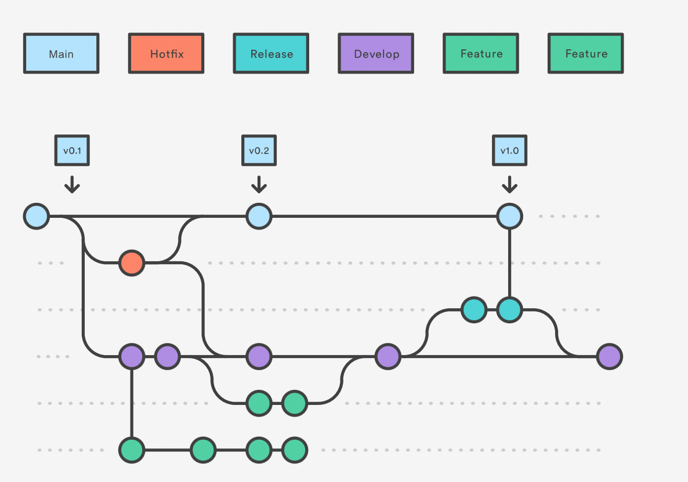

# Git Flows

tags: #git #gitflow

## Gitflow

**Some key takeaways to know about Gitflow are:**
- The workflow is great for a release-based software workflow.
- Gitflow offers a dedicated channel for hotfixes to production.
 
**The overall flow of Gitflow is:**
- Main branch is main.
- A develop branch is created from main.
- A release branch is created from develop.
- Feature branches are created from develop.
- When a feature is complete it is merged into the develop branch.
- When the release branch is done it is merged into develop and main.
- If an issue in main is detected a hotfix branch is created from main.
- Once the hotfix is complete it is merged to both develop and main.

## Feature Branch(GitHub Flow)

**Some key associations to make with the Feature Branch Workflow are:**

- focused on branching patterns
- can be leveraged by other repo oriented workflows
- promotes collaboration with team members through pull requests and merge reviews

## Links
- [Comparing Workflows](https://www.atlassian.com/git/tutorials/comparing-workflows)
- [Simple Git workflow is simple](https://www.atlassian.com/git/articles/simple-git-workflow-is-simple)

#git #github #gitflow #githubflow