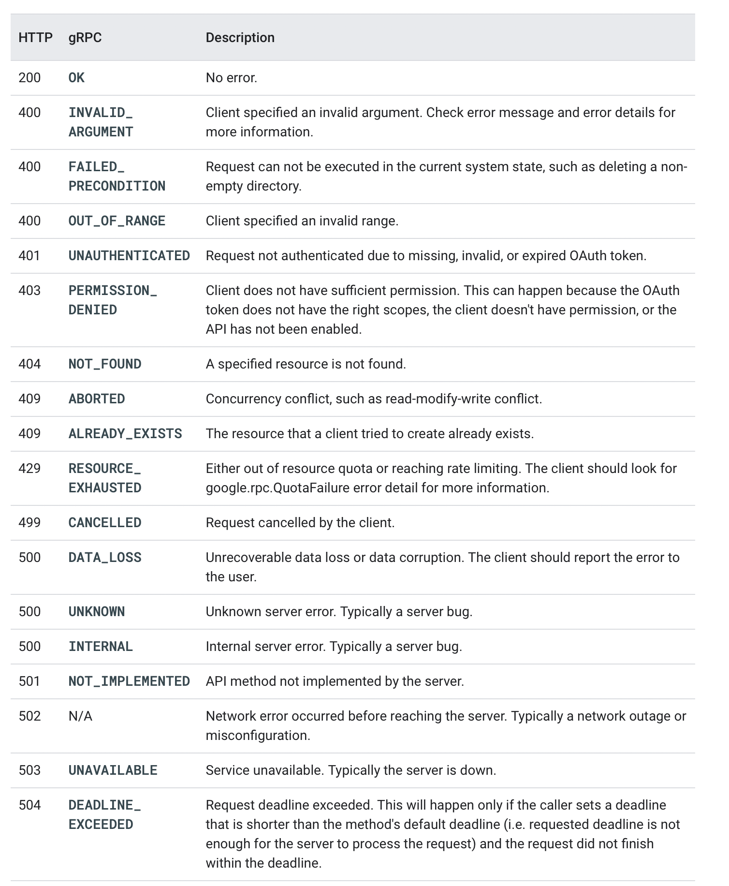
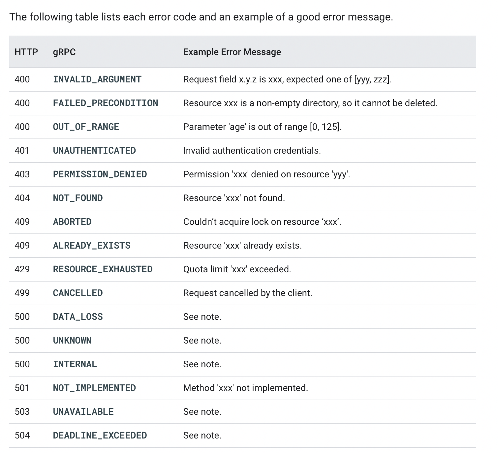
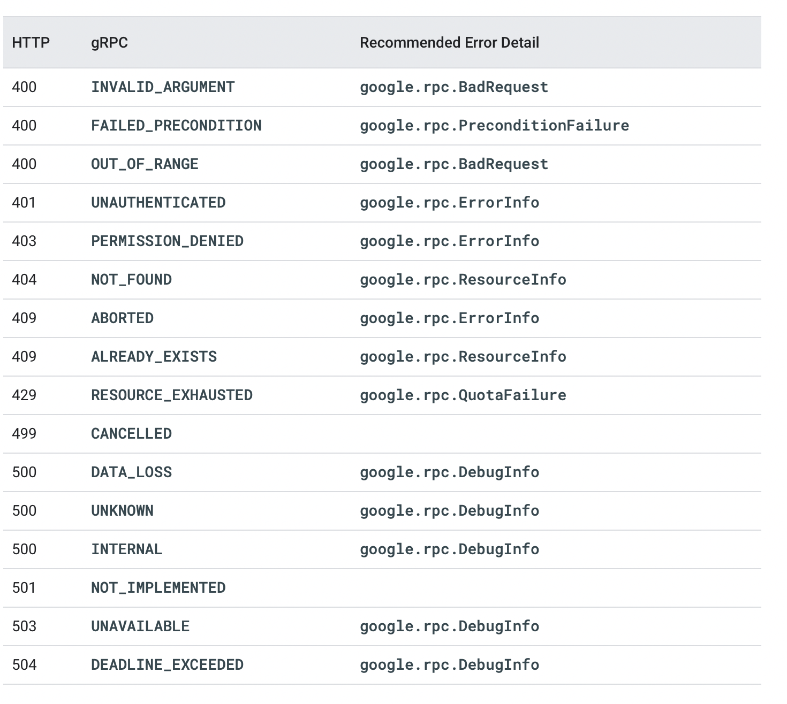
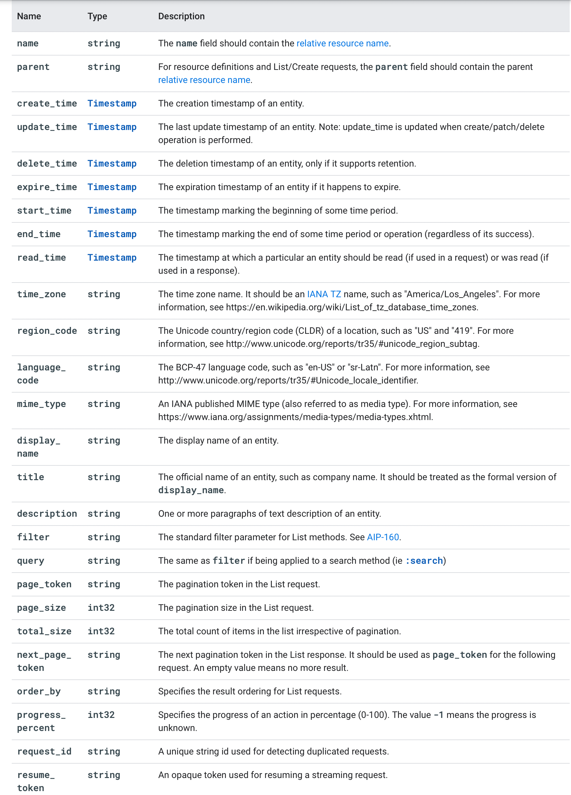
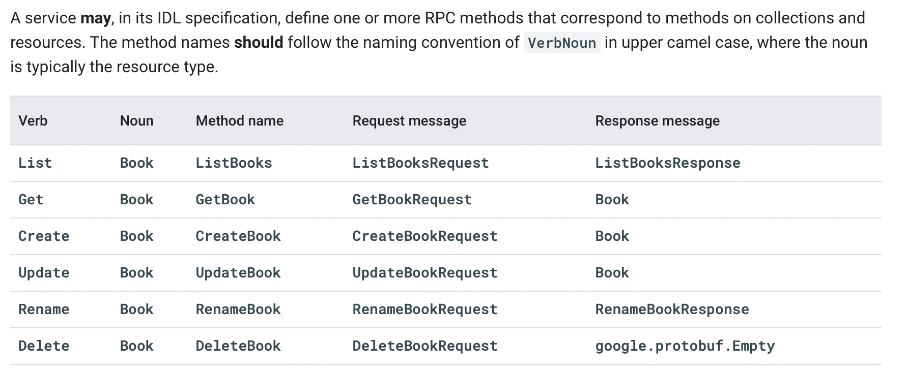

# Go/GRPC

tags #grpc #go

## Errors

```
package google.rpc;

// The `Status` type defines a logical error model that is suitable for
// different programming environments, including REST APIs and RPC APIs.
message Status {
  // A simple error code that can be easily handled by the client. The
  // actual error code is defined by `google.rpc.Code`.
  int32 code = 1;

  // A developer-facing human-readable error message in English. It should
  // both explain the error and offer an actionable resolution to it.
  string message = 2;

  // Additional error information that the client code can use to handle
  // the error, such as retry info or a help link.
  repeated google.protobuf.Any details = 3;
}
```

> When using gRPC, errors are included in the headers, and total headers in responses are limited to 8 KB (8,192 bytes). Ensure that errors do not exceed 1-2 KB in size.

> Error messages are not part of the API surface. They are subject to changes without notice. Application code must not have a hard dependency on error messages.

> Additional error detail types should only be introduced if they can assist application code to handle the errors.

> Propagating Errors
> If your API service depends on other services, you should not blindly propagate errors from those services to your clients. When translating errors, we suggest the following:
> - Hide implementation details and confidential information.
> - Adjust the party responsible for the error. For example, a server that receives an INVALID_ARGUMENT error from another service should propagate an INTERNAL to its own caller.

> Since the client cannot fix the server error, it is not useful to generate additional error details. To avoid leaking sensitive information under error conditions, it is recommended not to generate any error message and only generate google.rpc.DebugInfo error details. The DebugInfo is specially designed only for server-side logging, and must not be sent to client.







## Standard Fields


## Naming conventions

> Service names should be syntactically valid DNS names (as per RFC 1035) which can be resolved to one or more network addresses. The service names of public Google APIs follow the pattern: xxx.googleapis.com. For example, the service name of the Google Calendar is calendar.googleapis.com.




## Links

- [https://cloud.google.com/apis/design]()
- [https://docs.microsoft.com/en-us/aspnet/core/grpc/performance?view=aspnetcore-6.0](Performance best practices with gRPC)
- 