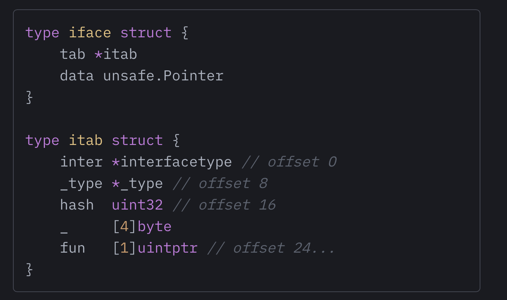

# Go/Generics can make your Go code slower

tags: #go  #generics

[link](https://planetscale.com/blog/generics-can-make-your-go-code-slower)

Monomorphized -  Copy and pasted, but with different types

The Generics implementation in Go 1.18 does not use monomorphization

Polymorphism is the provision of a single interface to entities of different types or the use of a single symbol to represent multiple different types.

Parametric polymorphism is "generics"

Way of implementing generics:

The first way is to make all the things that the function will operate on the look and act the same way. This approach is called “boxing”, and it usually involves allocating the things on the heap and just passing pointers to them to our function. Since all the things have the same shape (they’re pointers!), all we need to operate on them is knowing where the methods for those things live. Hence, the pointers to the things that are passed to our function are usually accompanied by a table of function pointers, often called a “virtual method table” or vtable for short. Does this ring a bell? This is how Go interfaces are implemented, but also dyn Traits in Rust, and virtual classes in C++. These are all forms of polymorphism that are easy to use in practice but are limited by their expressiveness and by their runtime overhead.

The second way to make a function operate on many different things is called “monomorphization.” The name may sound scary, but its implementation is relatively straightforward. It boils down to creating a different copy of the function for every unique thing it must operate on. That’s it, really. If you have a function that adds two numbers, and you call it to add two float64s, the compiler creates a copy of the function and replaces the generic type placeholder with float64, then compiles that function. It is by far the easiest way to implement polymorphism (even if sometimes it becomes quite hard to use in practice) and it is also the most expensive – for the compiler.

Interface

How bad is this extra dereference in practice? Intuitively, we can assume that calling methods on an object in a generic function will always be slower than in a non-generic function that simply takes an interface as an argument because Generics will devolve what previously were pointer calls into a twice-indirect interface call, ostensibly slower than a plain interface call.

