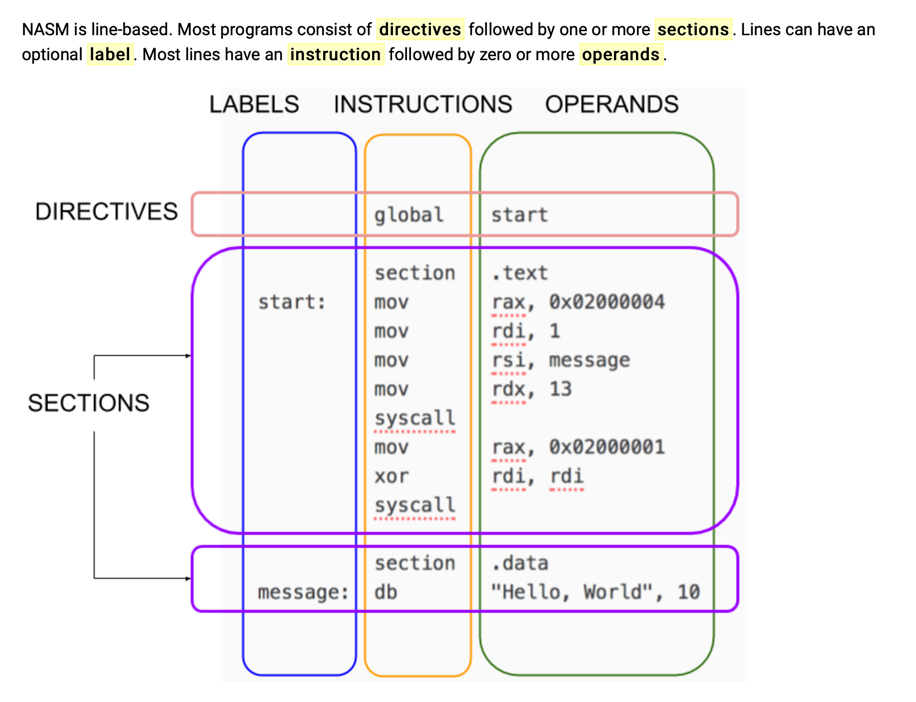
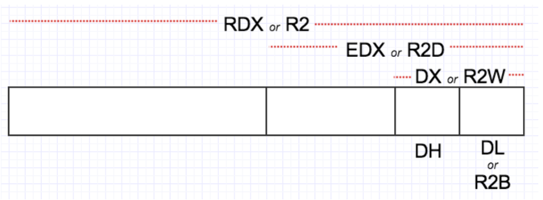

# nasm

**Structure of a NASM Program**

The 16 integer registers are 64 bits wide and are called:

_R0  R1  R2  R3  R4  R5  R6  R7  R8  R9  R10  R11  R12  R13  R14  R15
RAX RCX RDX RBX RSP RBP RSI RDI_

You can treat the lowest 32-bits of each register as a register itself but using these names:

_R0D R1D R2D R3D R4D R5D R6D R7D R8D R9D R10D R11D R12D R13D R14D R15D
EAX ECX EDX EBX ESP EBP ESI EDI_

You can treat the lowest 16-bits of each register as a register itself but using these names:

_R0W R1W R2W R3W R4W R5W R6W R7W R8W R9W R10W R11W R12W R13W R14W R15W
AX  CX  DX  BX  SP  BP  SI  DI_

You can treat the lowest 8-bits of each register as a register itself but using these names:

_R0B R1B R2B R3B R4B R5B R6B R7B R8B R9B R10B R11B R12B R13B R14B R15B
AL  CL  DL  BL  SPL BPL SIL DIL_

There are 16 XMM registers, each 128 bits wide, named:

_XMM0 ... XMM15_

**Run on MacOS**

`nasm -fmacho64 hello.asm && ld -macosx_version_min 10.7.0 -o hello hello.o && ./hello`

## Link

[Nasm Tutorial](https://cs.lmu.edu/~ray/notes/nasmtutorial/)
[ASM Tutorial](https://www.tutorialspoint.com/assembly_programming/index.htm)
[Nasm Hello Word. MacOS](https://medium.com/@thisura1998/hello-world-assembly-program-on-macos-mojave-d5d65f0ce7c6)
[Golang moving from stack to registers](https://menno.io/posts/golang-register-calling/)