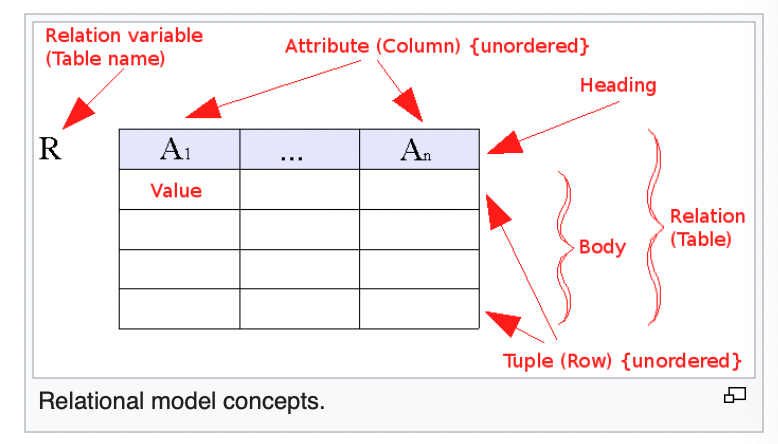
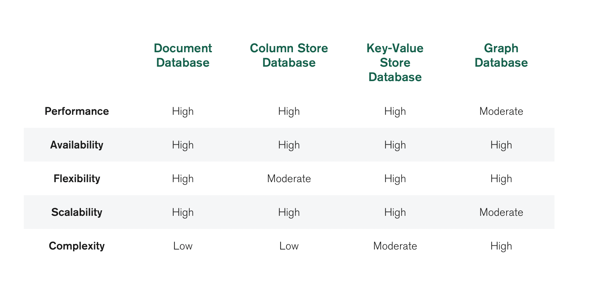
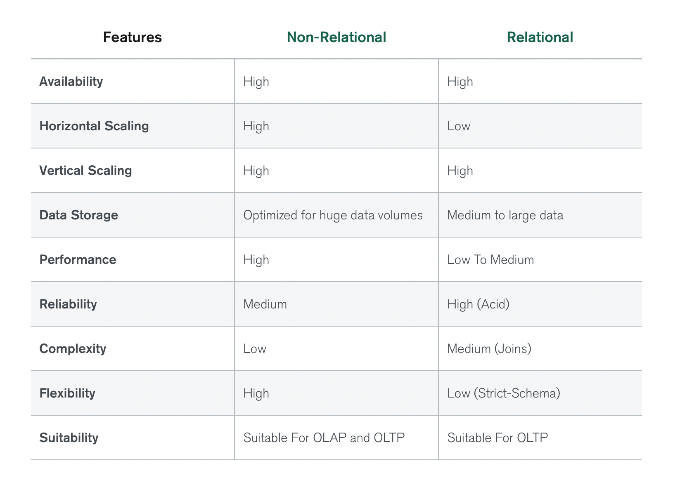

# Relational Database

tags: #doc #sumup #database

## TL;DR

- Relational database is a digital dabase based on the relation model of data.
- Relation model is a model where data is represented in terms of tuples, grouped into relations.
- Relation model was fist described by English computer scientist Edgar F.Codd.

## Notes

A relational database is a digital database based on the relational model of data, as proposed by E. F. Codd in 1970.

The relational model (RM) for database management is an approach to managing data using a structure and language consistent with first-order predicate logic, first described in 1969 by English computer scientist Edgar F. Codd,[1][2] where all data is represented in terms of tuples, grouped into relations. A database organized in terms of the relational model is a relational database.

**Rules to be a relational database:**

1. Present the data to the user as relations (a presentation in tabular form, i.e. as a collection of tables with each table consisting of a set of rows and columns);
2. Provide relational operators to manipulate the data in tabular form.

## Advantages of relational databases

- ACID compliance
- Data accuracy(foreign keys)
- Normalization(no duplications)
- Simplicity(SQL)

## Disadvantages of relational databases

- Scalability(Vertical)
- Flexibility(Need to do migration for adding new column)
- Performance(transactions)

 NoSQL (Not Only SQL)

NoSQL is any kind of database that doesn’t use the tables, fields, and columns structured data concept from relational databases. Non-relational databases have been designed with the cloud in mind, making them great at horizontal scaling.

**There are a few different groups of database types that store the data in different ways:**

- Document databases
- Key-value database
- Graph databases
- Wide-column databases

## Links

- [Relational database](https://en.wikipedia.org/wiki/Relational_database)
- [Relational vs. Non-Relational Databases](https://www.mongodb.com/compare/relational-vs-non-relational-databases)
