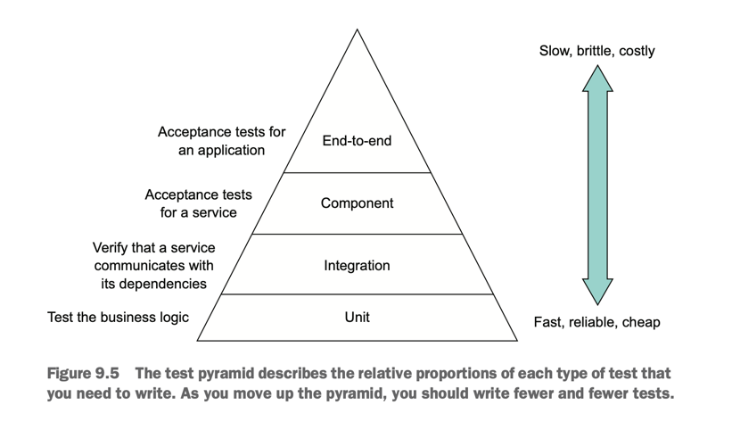

# Testing

tags: #testing #doc

- Unit tests—Test a small part of a service, such as a class.
- Integration tests—Verify that a service can interact with infrastructure services such as databases and other
  application services.
- Component tests—Acceptance tests for an individual service.
- End-to-end tests—Acceptance tests for the entire application.
- The terms stubs and mocks are often used interchangeably, although they have slightly different behavior. A stub is a
  test double that returns values to the SUT. A mock is a test double that a test uses to verify that the SUT correctly
  invokes a dependency. Also, a mock is often a stub.

## Notes

- Automated testing is the key foundation of rapid, safe delivery of software. What’s more, because of its inherent
  complexity, to fully benefit from the microservice architecture you must automate your tests.
- Unreliable tests are almost as bad as no tests, because if you can’t trust a test, you’re likely to ignore failures.

## End-to-End Testing

- Rather than create one action, is better to test complex flow.