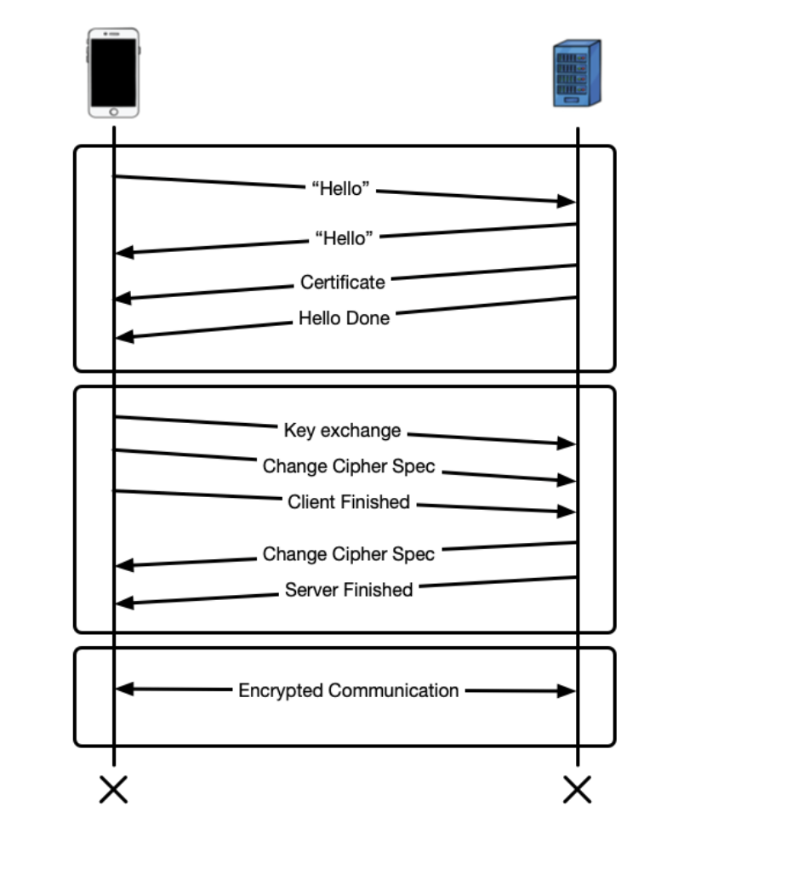

# mTLS

tags: #mtls

Mutual TLS (mTLS) is a type of authentication in which the two parties in a connection authenticate each other using the TLS protocol.

mTLS is often used in a Zero Trust security framework* to verify users, devices, and servers within an organization. It can also help keep APIs secure.

TLS certificate is a data file that contains important information for verifying a server's or device's identity, including the public key, a statement of who issued the certificate (TLS certificates are issued by a certificate authority), and the certificate's expiration date.

mTLS helps ensure that traffic is secure and trusted in both directions between a client and server. This provides an additional layer of security for users who log in to an organization's network or applications. It also verifies connections with client devices that do not follow a login process, such as Internet of Things (IoT) devices.

Websites already use TLS, so why is mTLS not used on the entire Internet?

Additionally, distributing TLS certificates to all end user devices would be extremely difficult. Generating, managing, and verifying the billions of certificates necessary for this is a near-impossible task.

But on a smaller scale, mTLS is highly useful and quite practical for individual organizations, especially when those organizations employ a Zero Trust approach to network security. Since a Zero Trust approach does not trust any user, device, or request by default, organizations must be able to authenticate every user, device, and request every time they try to access any point in the network. mTLS helps make this possible by authenticating users and verifying devices.

What is mutual authentication?

Mutual authentication is when two sides of a communications channel verify each other's identity, instead of only one side verifying the other. Mutual authentication is also known as "two-way authentication" because the process goes in both directions.

Common examples where mTLS is useful to include:

- Authenticating user devices on a corporate network
- Business-to-Business (B2B) communication through APIs
- IoT devices

HTTPS Works

X.509 certificates can be encoded differently, which will affect their appearance. The most common are:

- Privacy Enhanced Mail (PEM): A Base-64 encoding, whose file extension is .pem.
- Distinguished Encoding Rules (DER): A binary encoding, whose file extensions are .cer, .der and .crt.
- Public Key Cryptography Standards (PKCS): Used to exchange public and private objects in a single file. Its extensions are .p7b, .p7c, .p12, .pfx etc.
	
## Links
- [What is mutual TLS (mTLS)?](https://www.cloudflare.com/learning/access-management/what-is-mutual-tls/)
- [What is mutual authentication? | Two-way authentication](https://www.cloudflare.com/learning/access-management/what-is-mutual-authentication/)
- [What is Zero Trust security?](https://www.cloudflare.com/learning/security/glossary/what-is-zero-trust/)
- [mTLS- authentication from within the app](https://developer.apple.com/forums/thread/111983)
- [What Is mTLS?](https://www.f5.com/labs/articles/education/what-is-mtls)
- [What Is mTLS?](https://www.integrate.io/glossary/what-is-mtls/)